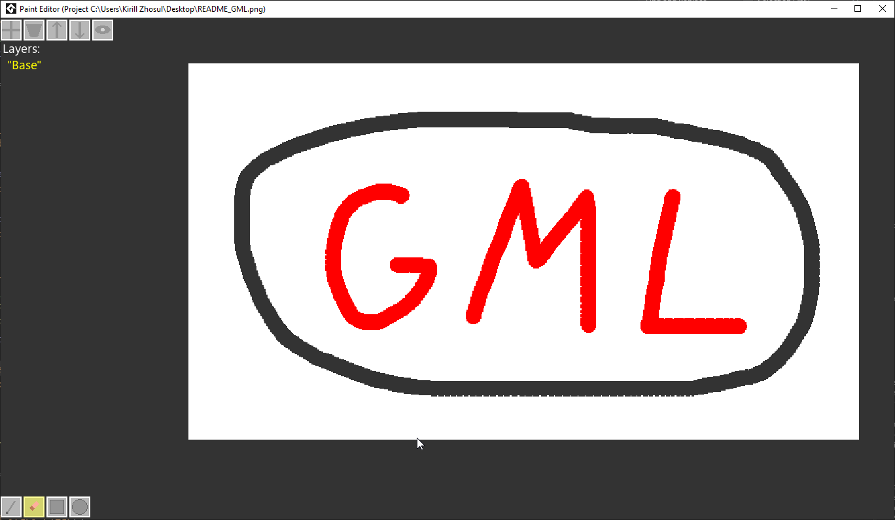
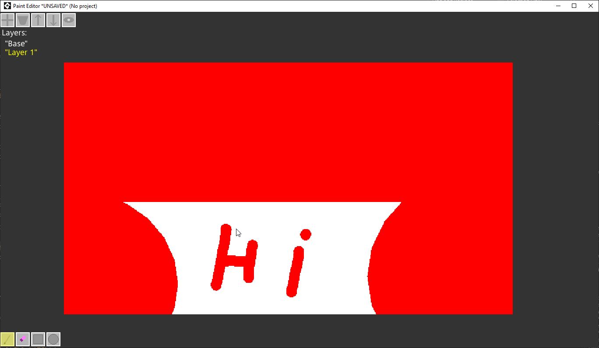

# Paint Editor
This repository contains "Paint Editor" project.

## Description
Paint editor written in GML (Game Maker Studio 2.3).

## Features
* Layers system (create, delete, move, hide/unhide)
* Tools (simple (pencil, eraser), rectangular (rectangle, ellipse))
* Projects system (save, load)
* Workspace interaction (zoom, move around), 
* Undo System (WIP, unstable).

## References
_Window Mouse Queue_ - Project uses this [extension](https://github.com/YAL-GameMaker/window_mouse_queue) by [YellowAfterlife](https://github.com/YellowAfterlife) to grab mouse move points.

## Previews

