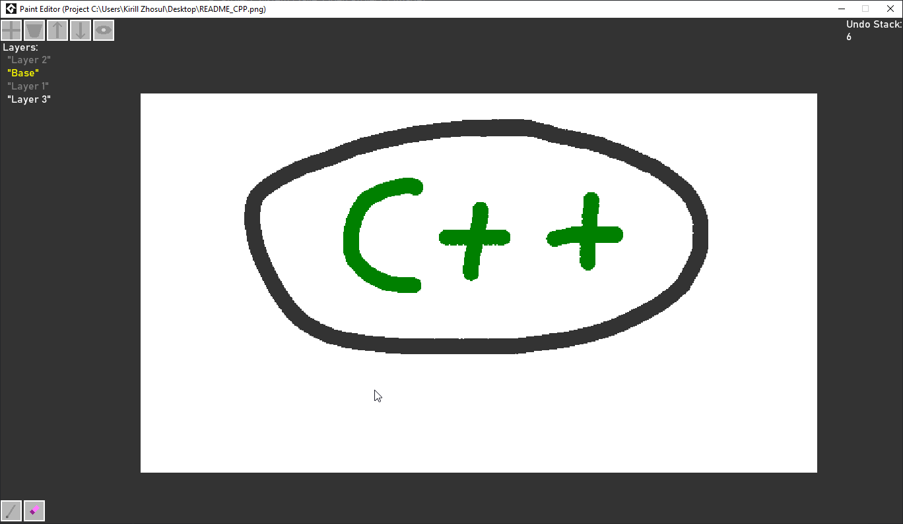

# Paint Pixel Editor
Pixel editor written in GML (Game Maker Studio 2.3).

## Features:
- Layers (Create, Swap, Hide, Delete),
- 2 Tools (WIP)(Pencil, Eraser).
- Project System (Save, Open Project / Image).
- Zoom / Move Image.
- Undo System (WIP)

## To Do:
- Color changing / selecting.
- Improve Undo / Redo system (As it should be).
- Add more tools.
- Add rectangular tools feature (Select / Region / Figures (Rectangle, Circle))
- Add filter tools.
- Add settings.
- Add tool options.
- etc.

## Note:
Project uses [Window Mouse Queue](https://github.com/YAL-GameMaker/window_mouse_queue) extension by [YellowAfterlife](https://github.com/YellowAfterlife) to grab mouse X/Y.

# Previews:

